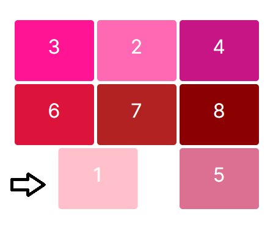
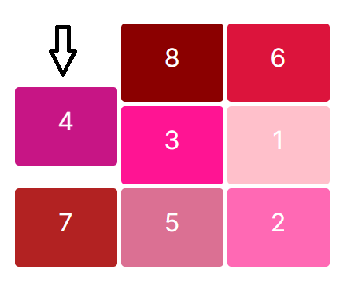

# Composants UI

(english version below)

## Présentation du Projet

Ce projet vise à créer des composants UI pour une utilisation dans des applications web. Pour l'instant, le composant principal développé ici est un composant de grille qui illustre les mouvements de cellules dans une disposition en grille. Le composant de grille utilise React.js ainsi que diverses bibliothèques pour obtenir des animations interactives de cellules.

## Structure du Projet

La structure du projet est organisée comme suit :

- **`pages`**: Contient les pages Next.js pour le routage et le rendu des composants.
- **`components`**: Contient des composants UI réutilisables.
  - **`GridComponent.tsx`**: Le composant de grille principal illustrant les animations et interactions des cellules.
- **`public`**: Contient des ressources statiques telles que des vidéos.


## Instructions d'Installation

1. **Cloner le Dépôt**
   ```bash
   git clone https://github.com/your-username/ui-components-project.git
    ```

3. **Installer les Dépendances**
   ```bash
   cd ui-components-project
   npm install
   ```

4. **Lancer le Serveur de Développement**
   ```bash
   npm run dev
   ```

   Ce commande démarre le serveur de développement. Ouvrez http://localhost:3000 pour le voir dans votre navigateur.


## Compatibilité

- **Version Next.js**: Ce projet est compatible avec la version 14.2.3 de Next.js.
- **Version Node.js**: Assurez-vous d'avoir la version 18 ou supérieure de Node.js installée sur votre système pour une compatibilité optimale avec Next.js et ce projet.

## Technologies Utilisées
- React.js : Bibliothèque frontend pour la création d'interfaces utilisateur.
- Next.js : Framework React pour le rendu côté serveur et le routage.
- react-intersection-observer : Bibliothèque pour observer quand les éléments entrent ou sortent de la vue.
- CSS : Stylisation des composants UI.
- TypeScript : Superset typé de JavaScript pour une qualité de code améliorée.

## Fonctionnalités du Composant de Grille
- Mouvements de Cellules Dynamiques : Les cellules dans la grille bougent de manière aléatoire à intervalles réguliers.
- Disposition en Grille CSS : Utilise CSS Grid pour positionner les éléments de la grille.
- Effets d'Animation : Animations fluides appliquées aux mouvements de cellules.

<div style="display: flex; justify-content: center;">
  
  
</div>

https://github.com/marionrobert/ui-components/assets/107509668/ed09afe8-68bd-491d-ac2a-57a326f15819

NB: La vidéo ne rend pas bien l'effet de transition lors du déplacement d'une cellule qui est plus lent en réalité.


## Fonctionnalités du Composant Wave:
- Effet de Vague Animé : Le composant génère une animation de vague en utilisant des propriétés CSS et des animations.
- Utilisation de Pseudo-Éléments : Les pseudo-éléments :after et :before sont utilisés pour créer les parties principales de l'effet de vague.
- Personnalisation : Les couleurs et les dimensions de l'effet de vague peuvent être facilement personnalisées en modifiant les valeurs dans le code CSS.

[Source Vidéo Tutorielle](https://www.youtube.com/watch?v=v5uHEUnEjwM)

https://github.com/marionrobert/ui-components/assets/107509668/c522313e-87e6-4f58-b6e7-05940408c26a


***
***


# UI Components Project


## Project Overview

This project aims to create UI components for use in web applications. For now, the main component developed here is a grid component that demonstrates cell movements within a grid layout. The grid component utilizes React.js and various libraries to achieve interactive cell animations.


## Project Structure

The project structure is organized as follows:

- **`pages`**: Contains Next.js pages for routing and rendering components.
- **`components`**: Contains reusable UI components.
  - **`GridComponent.tsx`**: The main grid component showcasing cell animations and interactions.
- **`public`**: Contains static assets like videos


## Setup Instructions

1. **Clone the Repository**
   ```bash
   git clone https://github.com/your-username/ui-components-project.git
    ```
2. **Install Dependencies**
   ```bash
   cd ui-components-project
   npm install
   ```
3. **Run the Development Server**
   ```bash
   npm run dev
   ```
   This command starts the development server. Open http://localhost:3000 to view it in your browser.

## Compatibility

- **Next.js Version**: This project is compatible with Next.js version 14.2.3.
- **Node.js Version**: Ensure you have Node.js version 18 or higher installed on your system for optimal compatibility with Next.js and this project.

## Technologies Used
- React.js: Frontend library for building user interfaces.
- Next.js: React framework for server-side rendering and routing.
- react-intersection-observer: Library for observing when elements enter or exit the viewport.
- CSS: Styling for UI components.
- TypeScript: Typed superset of JavaScript for improved code quality.

## Grid Component Feature
- Dynamic Cell Movements: Cells within the grid move randomly at regular intervals.
- CSS Grid Layout: Utilizes CSS Grid for positioning grid items.
- Animation Effects: Smooth animations applied to cell movements.

<div style="display: flex; justify-content: center;">
  
  
</div>


https://github.com/marionrobert/ui-components/assets/107509668/fe944c8d-bf59-4133-9690-8782f40eed18

N.B.: The video does not capture the transition effect well when moving a cell, which is normally slower.


## Wave Component Feature
- Animated Wave Effect: The component generates a wave animation using CSS properties and animations.
- Usage of Pseudo-Elements: The :after and :before pseudo-elements are utilized to create the main parts of the wave effect.
- Customization: The colors and dimensions of the wave effect can be easily customized by modifying the values in the CSS code.

[Source Video Tutorial](https://www.youtube.com/watch?v=v5uHEUnEjwM)

https://github.com/marionrobert/ui-components/assets/107509668/c522313e-87e6-4f58-b6e7-05940408c26a


